# 🎨 DIAGRAMA ER VISUAL - MÓDULA

> **Complemento do MER Completo**  
> Representação visual das entidades e relacionamentos usando Mermaid Diagram

---

## 📊 DIAGRAMA ENTIDADE-RELACIONAMENTO

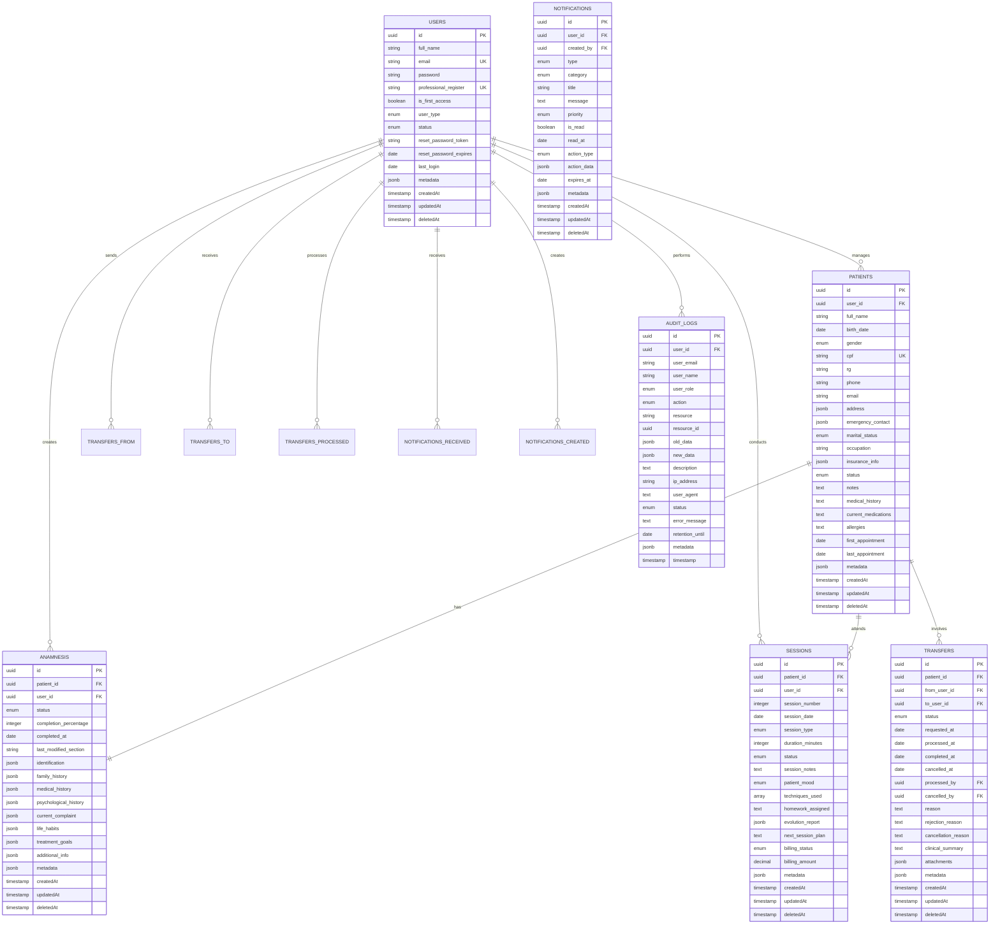

---

## 🔄 DIAGRAMA DE FLUXOS PRINCIPAIS

### Fluxo de Transferência de Paciente

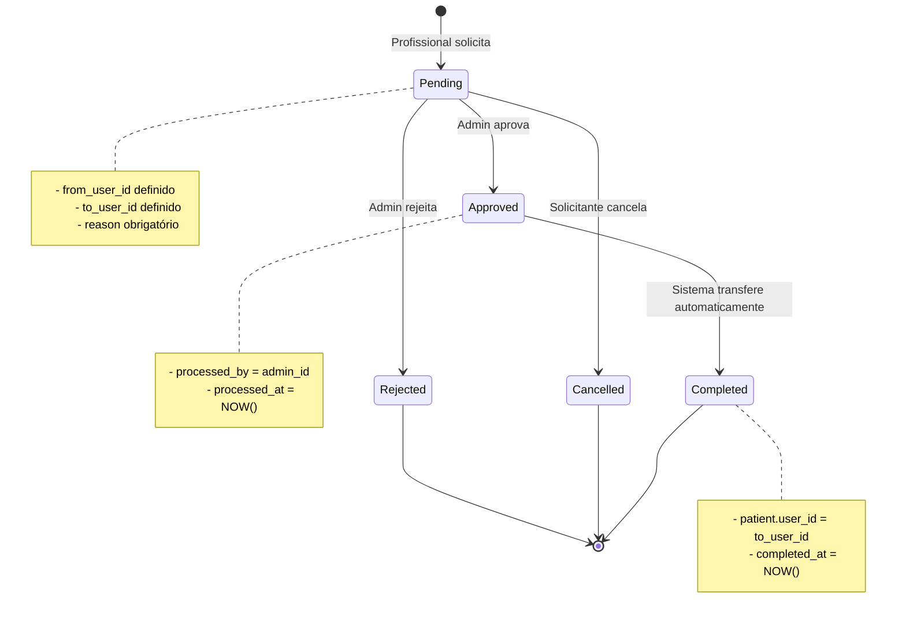

### Fluxo de Sessão

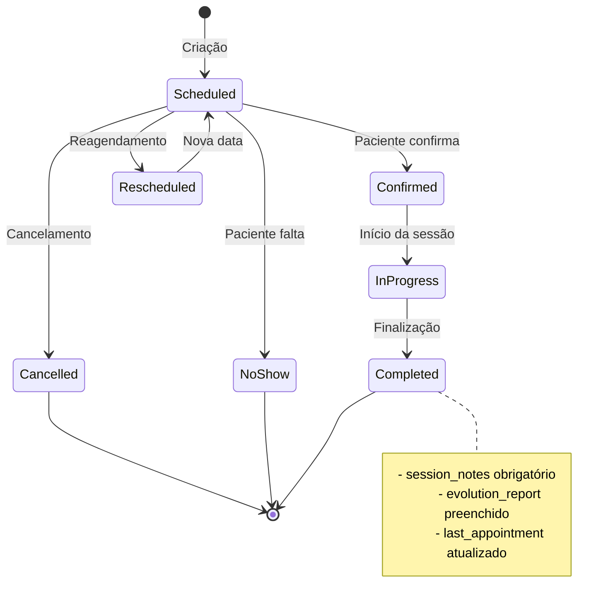

### Fluxo de Anamnese

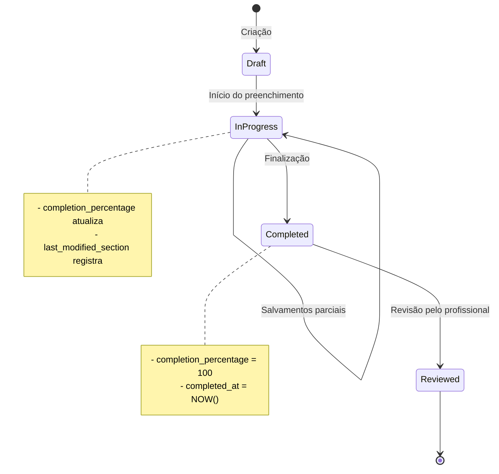

---

## 📈 DIAGRAMA DE CARDINALIDADES

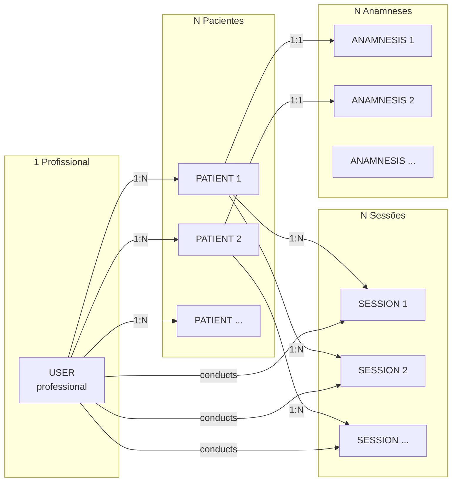

---

## 🔐 DIAGRAMA DE SEGURANÇA E AUDITORIA

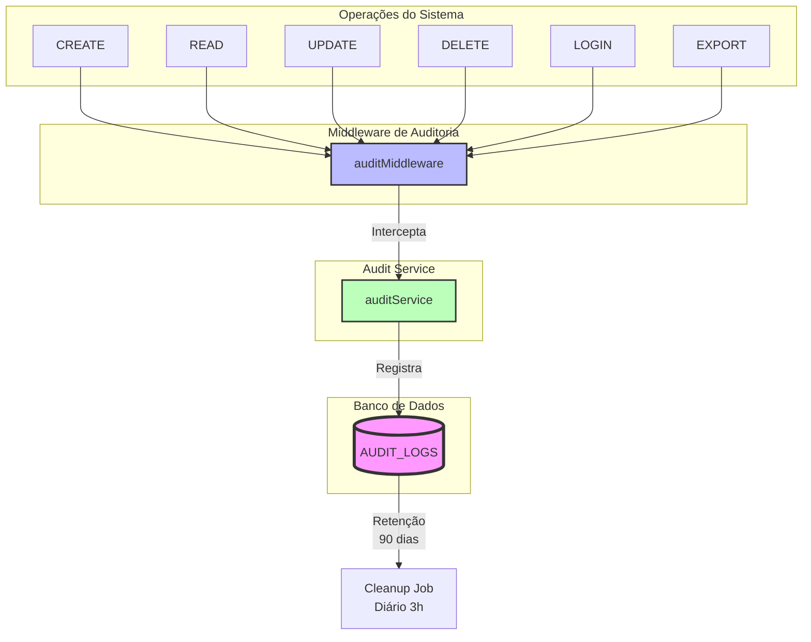

---

## 📊 DIAGRAMA DE JOBS AUTOMATIZADOS

```mermaid
gantt
    title Jobs Automatizados do Sistema
    dateFormat HH:mm
    axisFormat %H:%M
    
    section Backup
    Backup Diário           :done, 02:00, 30m
    
    section Auditoria
    Cleanup Logs            :done, 03:00, 15m
    
    section Monitoramento
    Health Check            :active, 00:00, 24h
    
    section Notificações
    Triggers em Tempo Real  :active, 00:00, 24h
```

**Frequências:**
- **Backup Job:** Diariamente às 02:00
- **Audit Cleanup Job:** Diariamente às 03:00
- **Health Check Job:** A cada 5 minutos (24/7)
- **Notification Triggers:** Em tempo real (event-driven)

---

## 🗂️ DIAGRAMA DE ÍNDICES POR TABELA

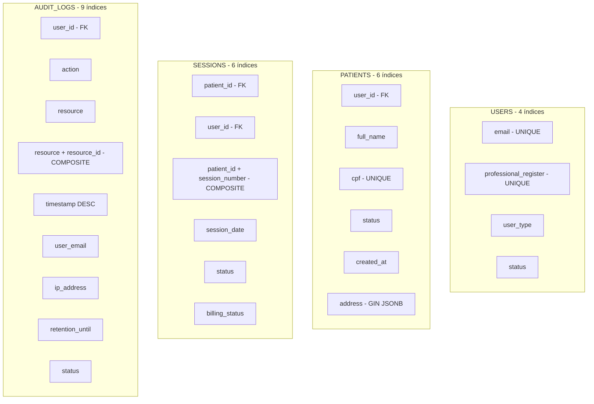

---

## 💾 DIAGRAMA DE ESTRATÉGIAS DE DELEÇÃO

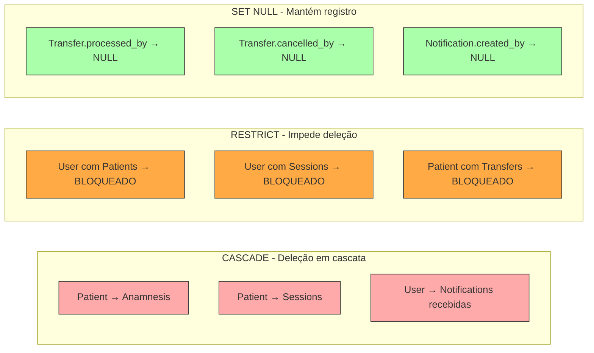

**Legenda:**
- 🔴 **CASCADE:** Dados dependentes são deletados
- 🟠 **RESTRICT:** Operação é bloqueada se houver dependências
- 🟢 **SET NULL:** Referência é anulada mas registro é mantido

---

## 🔄 DIAGRAMA DE RELACIONAMENTOS MÚLTIPLOS (TRANSFER)

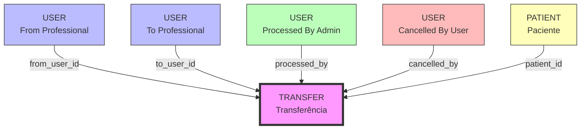

**4 Foreign Keys para USER na mesma tabela!**

---

## 📱 DIAGRAMA DE CASOS DE USO

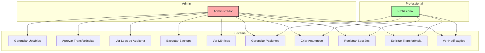

---

**Este diagrama complementa o MER_COMPLETO.md com representações visuais.**

**Desenvolvido por:** Equipe Módula  
**Versão:** 2.0.0  
**Data:** 06 de Novembro de 2025
